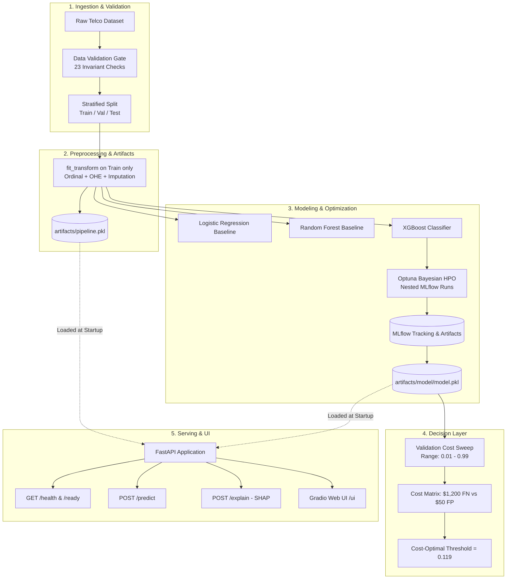

# 🔮 Production Telecom Customer Churn Prediction & MLOps Platform

[](https://github.com/Kurra-Srinivas/production-mlops-churn-prediction/actions/workflows/ci.yml)
[](https://www.python.org/)
[](https://fastapi.tiangolo.com)
[](https://mlflow.org)
[](https://www.docker.com/)
[](https://opensource.org/licenses/MIT)

> **An end-to-end Machine Learning and MLOps system featuring leakage-free preprocessing, Bayesian hyperparameter tuning, financial business-cost threshold optimization, real-time SHAP explainability, and containerized FastAPI + Gradio serving.**


## 🚀 Executive Overview

Acquiring a new telecom subscriber is estimated to cost **5x to 7x more** than retaining an existing customer. Standard machine learning classifiers apply an arbitrary decision threshold of `0.50`, which treats false negatives and false positives identically. In churn prevention, failing to detect a churning subscriber ($1,200 lost customer lifetime value) is far more damaging than sending a proactive retention discount ($50 outreach cost).

This repository implements a production system that:
1. **Guarantees Zero Skew**: Uses a single serialized `ColumnTransformer` pipeline artifact across training, validation, test, and real-time inference.
2. **Optimizes Decision Thresholds for Financial Impact**: Selects the threshold that minimizes expected business cost per customer on validation data.
3. **Explains Every Prediction in Real-Time**: Provides exact SHAP feature attributions at inference time via `/explain`.
4. **Serves via REST & Interactive UI**: Provides a FastAPI backend with mounted Gradio web UI and OpenAPI documentation.
5. **Ensures Reliability**: Validated by 36 unit and integration tests and containerized via a multi-stage Docker build.

---

## 🏗️ System Architecture



---

## 💡 Key Engineering Highlights

| Capability | Implementation | Technical Advantage |
| :--- | :--- | :--- |
| **Train/Serve Parity** | `scikit-learn.compose.ColumnTransformer` | Single source of truth. Prevents feature mismatch without relying on `pd.get_dummies`. |
| **Data Quality Gate** | Automated validation suite (`src/utils/validate_data.py`) | 23 rigorous checks covering missing values, categorical domains, ranges, and consistency. |
| **Hyperparameter Tuning** | `Optuna` + `MLflow` | Bayesian parameter optimization maximizing validation PR-AUC with automatic child run logging. |
| **Business Cost Layer** | Fine-grained sweep ($\theta \in [0.01, 0.99], \Delta=0.001$) | Replaces the arbitrary 0.5 default threshold with an asymmetric financial cost minimization. |
| **Explainable AI** | `SHAP TreeExplainer` | Deconstructs individual customer predictions into top risk factors with sub-millisecond response times. |
| **Production API** | `FastAPI` (Pydantic v2) + `Gradio` | Schema-validated REST endpoints with an interactive browser portal. |
| **Containerization** | Multi-stage `dockerfile` | Security-hardened non-root user (`appuser`), healthcheck probe, and minimal footprint. |
| **CI/CD Automation** | `GitHub Actions` | Multi-Python testing matrix (3.11, 3.12, 3.13), Ruff linting, and automated Docker build testing. |

---

## 📊 Model Exploration & Benchmarks

All models were evaluated on the holdout test set (1,409 customers). Because telecom churn exhibits class imbalance (~26.5% churn rate), **PR-AUC (Precision-Recall Area Under Curve)** and **Recall** serve as primary evaluation metrics.

| Model Family | Pipeline Preprocessing | Test PR-AUC | Test ROC-AUC | Test F1-Score | Brier Score |
| :--- | :--- | :---: | :---: | :---: | :---: |
| **Logistic Regression** (Baseline) | StandardScaler + OHE | 0.635 | 0.842 | 0.600 | 0.138 |
| **Random Forest** (Baseline) | Tree (Unscaled) + OHE | 0.655 | 0.844 | 0.597 | 0.134 |
| **XGBoost Classifier** (Tuned) | Tree (Unscaled) + OHE | **0.655** | **0.841** | **0.634** | **0.135** |

---

## 💰 Business Cost Layer & ROI Analysis

Misclassifications carry asymmetric financial costs:
- **False Negative ($C_{\text{FN}} = \$1,200$)**: A churning customer is missed $\rightarrow$ Lost remaining Customer Lifetime Value.
- **False Positive ($C_{\text{FP}} = \$50$)**: A loyal subscriber is flagged $\rightarrow$ Cost of retention outreach / discount.

$$\text{Total Cost}(\theta) = (1,200 \times \text{FN}) + (50 \times \text{FP})$$

By sweeping thresholds on the validation set, the optimal decision threshold was identified at **$\theta^* = 0.119$**:

| Operating Threshold | Precision | Recall (Churners) | F1-Score | False Positives | False Negatives | Expected Cost / Customer |
| :---: | :---: | :---: | :---: | :---: | :---: | :---: |
| 0.050 | 0.3667 | 0.9933 | 0.5356 | 512 | 2 | $37.33 |
| **0.119 (Optimal)** | **0.4727** | **0.9599** | **0.6337** | **321** | **12** | **$34.42** |
| 0.200 | 0.5332 | 0.9130 | 0.6732 | 239 | 26 | $37.52 |
| 0.350 | 0.6358 | 0.7760 | 0.6990 | 133 | 67 | $61.77 |
| 0.500 (Default) | 0.7077 | 0.5318 | 0.6074 | 66 | 140 | $121.57 |

> **Financial ROI**: Shifting from the naive default threshold of `0.50` to the cost-optimal threshold of **`0.119`** captures **95.99% of churners** and reduces expected business losses from **$121.57 down to $34.42 per customer (a 71.7% cost reduction)**.

---

## 🔍 Explainable AI (SHAP)

Every churn prediction can be explained locally via the `/explain` endpoint:

```json
{
  "prediction": "Likely to churn",
  "churn_probability": 0.8531,
  "base_value": -0.0313,
  "top_contributing_factors": [
    {
      "feature": "tenure",
      "shap_value": 1.6971,
      "impact": "increases_churn_risk"
    },
    {
      "feature": "MonthlyCharges",
      "shap_value": 0.0930,
      "impact": "increases_churn_risk"
    },
    {
      "feature": "Contract_Month-to-month",
      "shap_value": 0.0812,
      "impact": "increases_churn_risk"
    }
  ]
}
```

---

## 🔌 API & Interactive UI Reference

| Method | Path | Description | Response Status |
| :--- | :--- | :--- | :--- |
| `GET` | `/` | Root service info and links | `200 OK` |
| `GET` | `/health` | Liveness & pipeline readiness probe | `200 OK` |
| `GET` | `/ready` | Orchestration readiness probe | `200 OK` |
| `POST` | `/predict` | Predict churn status & probability | `200 OK` |
| `POST` | `/explain` | Churn prediction + top SHAP risk factors | `200 OK` |
| `GET` | `/ui` | Interactive Gradio prediction interface | `200 OK` |
| `GET` | `/docs` | Interactive Swagger / OpenAPI documentation | `200 OK` |

---

## 🛠️ Quick Start & Local Reproduction

### 1. Environment Setup
```bash
git clone https://github.com/Kurra-Srinivas/production-mlops-churn-prediction.git
cd production-mlops-churn-prediction

python -m venv .venv
# On Windows:
.venv\Scripts\activate
# On Linux/macOS:
source .venv/bin/activate

pip install -r requirements.txt
pip install -r requirements-dev.txt
```

### 2. Run the End-to-End Training Pipeline
```bash
# Run training with automatic business-cost threshold optimization
python scripts/run_pipeline.py --input data/raw/Telco-Customer-Churn.csv --target Churn

# Run with Optuna Bayesian hyperparameter optimization (10 trials)
python scripts/run_pipeline.py --input data/raw/Telco-Customer-Churn.csv --tune --n_trials 10
```

### 3. Launch MLflow Experiment UI
```bash
# On Windows PowerShell:
$env:MLFLOW_ALLOW_FILE_STORE="true"; python -m mlflow ui

# On Linux/macOS:
MLFLOW_ALLOW_FILE_STORE=true python -m mlflow ui
```
Open **[http://localhost:5000](http://localhost:5000)** to view runs, parameters, and metrics.

### 4. Launch FastAPI Server & Gradio UI
```bash
python -m uvicorn src.app.main:app --host 127.0.0.1 --port 8000 --reload
```
- **Interactive Web UI**: [http://localhost:8000/ui](http://localhost:8000/ui)
- **Interactive API Docs**: [http://localhost:8000/docs](http://localhost:8000/docs)
- **Health Check**: [http://localhost:8000/health](http://localhost:8000/health)

---

## 🐳 Docker Deployment

Build and run the production multi-stage container:

```bash
# Build Docker image
docker build -t telco-churn:latest .

# Run container
docker run -d -p 8000:8000 --name telco-service telco-churn:latest

# Verify health probe
curl http://localhost:8000/health
```

Access the web interface at **[http://localhost:8000/ui](http://localhost:8000/ui)**.

---

## 🧪 Automated Testing

All **36 unit and integration tests** pass:

```bash
pytest tests/ -v
```

Tests cover:
- **Data Validation**: 23 schema, range, and logic constraint checks.
- **Preprocessing Pipeline**: Determinism, shape consistency, missing value imputation, and unknown category handling.
- **Explainability**: SHAP value calculation and local attributions.
- **Business Cost**: Metric calculations, threshold search, and cost evaluation.
- **REST Endpoints**: `/health`, `/ready`, `/predict`, `/explain`, and payload validation.

---

## 📁 Project Directory Layout

```
├── artifacts/              # Serialized pipeline.pkl and model.pkl
├── configs/                # Business and model YAML configurations
├── data/
│   └── raw/                # Telco-Customer-Churn.csv dataset
├── dockerfile              # Multi-stage Docker container definition
├── notebooks/              # Exploratory Data Analysis (EDA.ipynb)
├── scripts/
│   ├── download_data.py    # Dataset fetching script
│   └── run_pipeline.py     # Training and tuning CLI entrypoint
├── src/
│   ├── api/                # FastAPI routers and Pydantic schemas
│   ├── app/                # Application entrypoint & Gradio UI mount
│   ├── pipeline/           # Preprocessing, train, tune, evaluate, explain
│   ├── serving/            # Inference engine
│   └── utils/              # Data validation and helper functions
├── tests/                  # 36 Unit and integration tests
├── architecture.md         # Detailed architectural blueprint
├── requirements.txt        # Production dependencies
└── requirements-dev.txt    # Testing & development dependencies
```

---

## 📜 License
This project is open-source and available under the [MIT License](LICENSE).